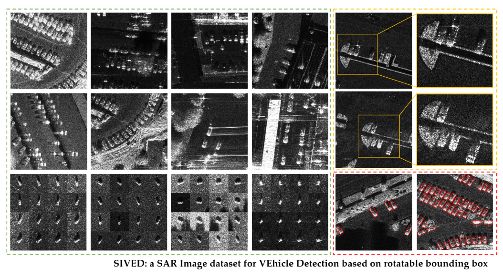
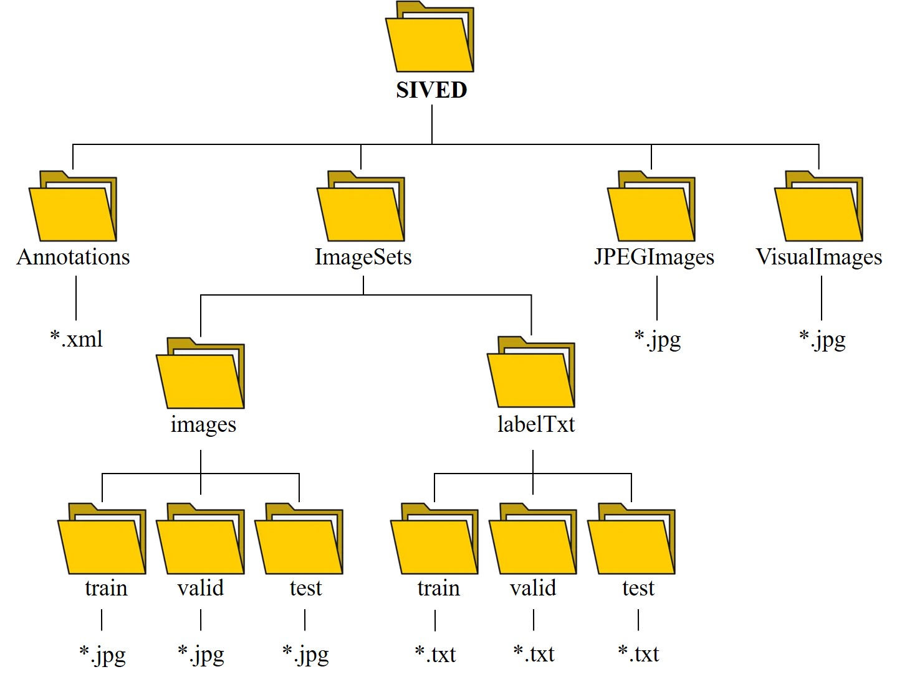

# SIVED Dataset for Rotating Box Detection in Vehicle Detection SAR Images

The SIVE dataset provides a vehicle detection format based on Rotated Boxes (RBN), which is suitable for YOLO and similar object detection frameworks. The dataset contains images of vehicles in various scenarios, as well as corresponding annotations such as position, size, and angle.

- **Data Source**: This dataset is proposed by Lin Xin, Zhang Bo, Wu Fan, and others, and published in the Remote Sensing Journal.
- **Dataset Features**: It uses rotatable bounding boxes to improve positioning accuracy, suitable for tasks such as Rotated Box Detection, like the YOLO series models.
- **File Structure**: The dataset is divided into four main parts: `Annotations`, `ImageSets`, `JPEGImages`, and `VisualImage`. The `Annotations` store XML formatted annotation information, while the `labelTxt` folder in the `ImageSets` provides DOTA formatted annotation instances, facilitating direct use.
- **Application Scenario**: This dataset can be applied to autonomous vehicles' vision recognition systems, such as urban traffic monitoring or scene analysis of autonomous cars.

In summary, the SIVEdataset provides rich training data for vehicle detection based on rotational boxes which helps to improve the performance and accuracy of related applications.
## Images

Here is a pay link on Stripe ( https://buy.stripe.com/3cs8yP7sY87d0vu9AB ). Please contact me lonlonago@foxmail.com after funding $89, and I will send you a complete data files , thank you!

